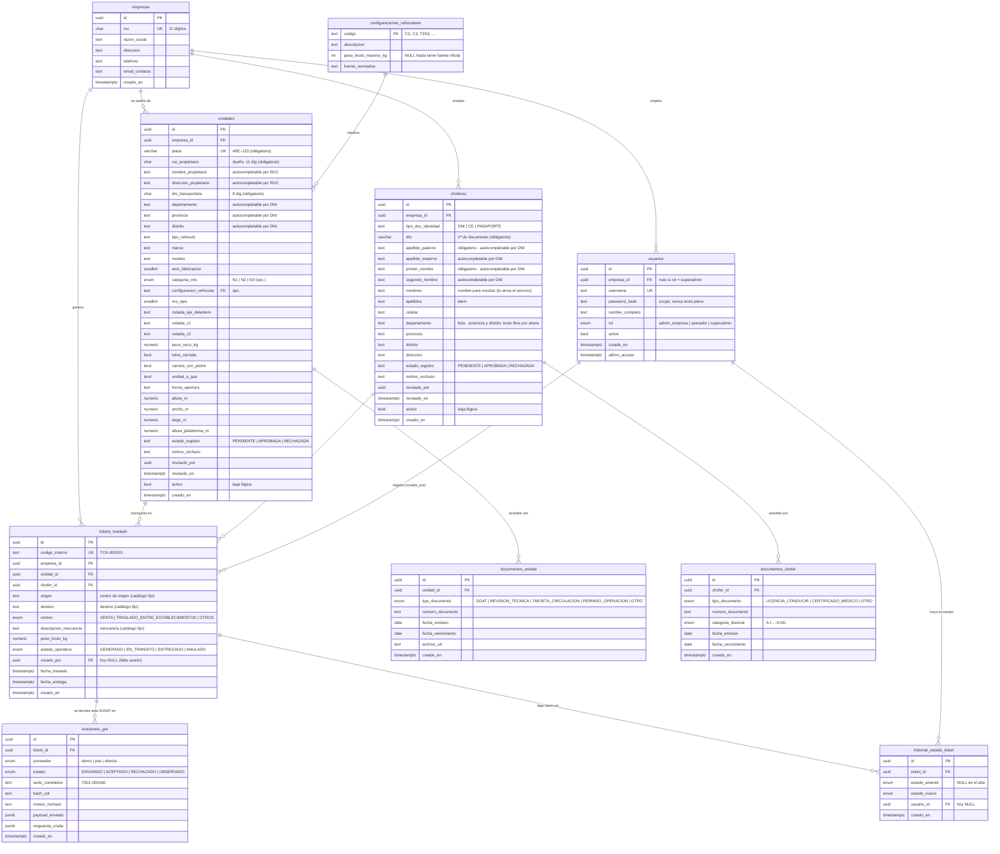
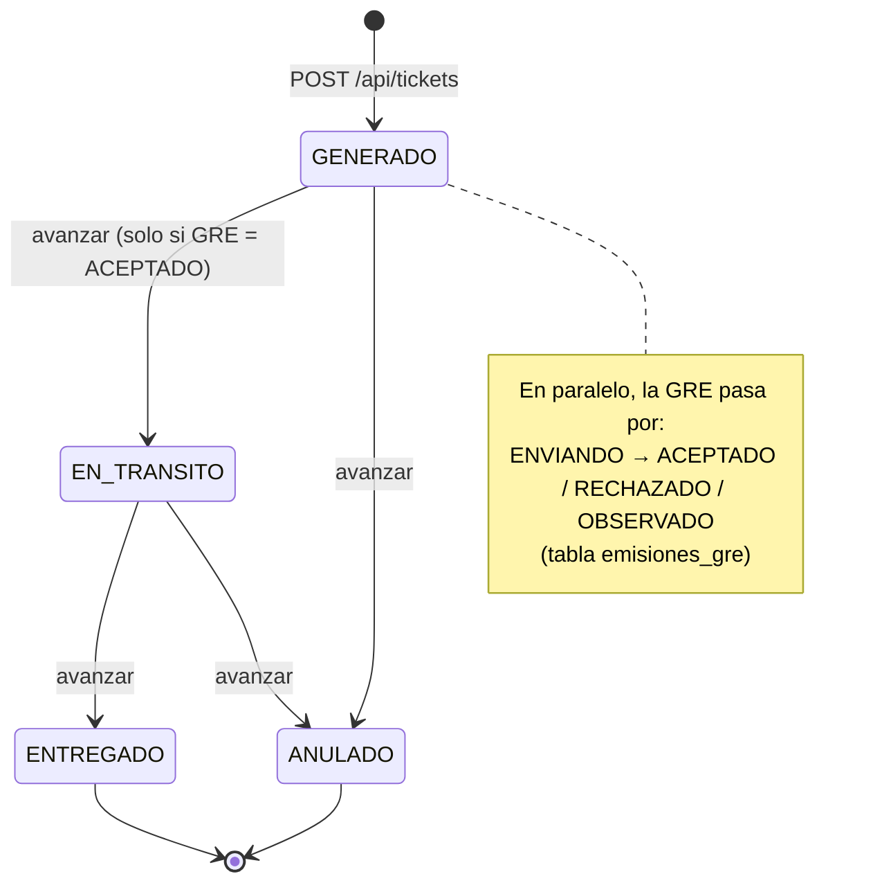

# TransGuía — Modelo de datos y API

Documento de referencia. Dos partes:

1. **Diagrama de entidades** — qué tablas hay en la base (Supabase) y cómo se relacionan.
2. **Endpoints** — para qué sirve cada URL de la API (`server.js`).

> Los diagramas están en formato **Mermaid**: GitHub y VS Code (con la extensión
> "Markdown Preview Mermaid Support") los dibujan solos. Si no, se pueden pegar en
> <https://mermaid.live>.

---

## 1. Diagrama de entidades relacionadas



### Cómo leer las relaciones

| Símbolo | Significado |
|---|---|
| `||--o{` | "uno a muchos": un lado tiene **uno**, el otro puede tener **cero o varios** |
| `PK` | *Primary Key* — identificador único de la fila |
| `FK` | *Foreign Key* — apunta a la fila de otra tabla |
| `UK` | *Unique* — no se puede repetir |

En palabras simples:

- Una **empresa** es el centro de todo: tiene sus **usuarios**, sus **unidades**, sus
  **choferes** y sus **tickets**. Todo lo demás cuelga de ahí.
- Cada **unidad** debe tener una **configuración vehicular** válida (un código del
  Anexo IV del Reglamento Nacional de Vehículos: C2, C3, T3S3…).
- Un **ticket de traslado** junta *una* unidad + *un* chofer + una ruta + una carga.
  La unidad y el chofer **ya deben estar registrados**: el ticket los referencia por
  su `id`, no vuelve a escribir la placa ni el DNI.
- Cada ticket tiene:
  - una o más **emisiones_gre** (el intento de declarar la guía ante SUNAT; se crea
    una fila al generar el ticket, y ahí queda si SUNAT la aceptó, rechazó, etc.);
  - un **historial_estado_ticket** con cada cambio de estado operativo
    (generado → en tránsito → entregado, o anulado).
- **documentos_unidad** y **documentos_chofer** guardan los papeles con vencimiento
  (SOAT, revisión técnica, licencia de conducir, certificado médico…).

### Estado de uso hoy

| Tabla | ¿La usa el backend hoy? |
|---|---|
| `empresas` | Sí — el superadmin las lista/crea (`/api/empresas`); un admin de empresa se crea con `crear-empresa.js` |
| `usuarios` | Sí — registro / login. `empresa_id` nulo para el superadmin |
| `configuraciones_vehiculares` | Sí — la referencian las unidades (13 códigos ya cargados; el peso máximo está en NULL a propósito) |
| `unidades` | Sí — alta / listado / baja lógica |
| `choferes` | Sí — alta / listado / baja lógica |
| `tickets_traslado` | Sí — alta / listado / detalle / cambio de estado |
| `emisiones_gre` | Sí — la escribe `ticketsRepoPostgres` al emitir la GRE |
| `historial_estado_ticket` | Sí — se escribe en cada cambio de estado; `usuario_id` = quién lo hizo |
| `documentos_unidad` | Sí — alta / listado / borrado (SOAT, revisión técnica…) |
| `documentos_chofer` | Sí — alta / listado / borrado. La licencia vigente se manda en la GRE |
| `vencimientos_proximos` (vista) | Sí — la usa `GET /api/vencimientos` |

### Ciclo de vida de un ticket



---

## 2. Endpoints de la API

Base local: **`http://localhost:3001`**. Todas las respuestas son JSON.
Los errores llegan como `{ "error": "mensaje entendible" }` con código HTTP
400 (datos inválidos), 401 (sin token / expirado), 403 (rol sin permiso)
o 404 (no encontrado).

El contrato formal está en `contrato-api.yaml` (OpenAPI 3.1, pegable en
<https://editor.swagger.io>).

### Cómo funciona la seguridad

- **Público:** solo `GET /api/health` y `POST /api/auth/login`.
- Todo lo demás exige la cabecera **`Authorization: Bearer <token>`**. El
  token lo devuelve el login y dura **12 horas**.
- El **`empresaId` sale del token**, nunca del cliente. Un usuario jamás
  ve datos de otra empresa.
- Rutas marcadas **(admin)**: devuelven **403** si el rol es `operador`.

### Los tres roles

| Rol | Qué puede hacer |
|---|---|
| `operador` | Crear y mover tickets de su empresa. |
| `admin_empresa` | Todo lo del operador + registrar unidades, choferes, documentos y usuarios de su empresa. |
| `superadmin` | Rol de plataforma, **sin empresa propia** (`empresa_id` nulo). Ve **todas** las empresas (`GET /api/empresas`, `GET /api/resumen`) y consulta los datos de cualquiera pasando `?empresaId=<uuid>` en las rutas de lectura. **Solo lectura**: no puede crear/editar datos de empresa (403). |

### Sistema y autenticación

| Método y ruta | Para qué sirve | Entrada | Salida |
|---|---|---|---|
| `GET /api/health` | Ping del servicio (para el hosting). Público. | — | `{ ok, servicio, gre }` |
| `POST /api/auth/login` | Ingresar. Público. | `username`, `password` | `{ id, empresaId, username, nombreCompleto, rol, token, expiraEnMs }` |
| `POST /api/auth/registro` **(admin)** | Crear un usuario en **mi misma empresa**. | `username`, `password` (mín. 8), `nombreCompleto`, `rol` opcional (por defecto `operador`) | El usuario creado (sin contraseña) |

### Plataforma (solo `superadmin`)

| Método y ruta | Para qué sirve | Salida |
|---|---|---|
| `GET /api/resumen` | Totales de toda la plataforma (empresas, unidades, choferes, tickets por estado, documentos vencidos). | `{ empresas, unidadesActivas, ... }` |
| `GET /api/empresas` | Todas las empresas con su resumen (unidades, choferes, tickets, docs vencidos). | Arreglo de empresas |
| `POST /api/empresas` | Crear una empresa **y su primer administrador** de una vez. | `{ empresa, admin }` |

> Para ver el detalle de **una** empresa, el superadmin usa las rutas
> normales (`GET /api/unidades`, `/api/tickets`, `/api/vencimientos`…)
> agregando `?empresaId=<uuid>`.

### Dashboard (`admin_empresa` y `superadmin`)

| Método y ruta | Para qué sirve |
|---|---|
| `GET /api/dashboard?ventana=7d\|30d\|90d\|12m` | **Indicadores de gestión.** Todo medido sobre una ventana móvil (default `30d`; `12m` agrupa por mes). Devuelve: **6 KPI** con variación vs. el período previo — toneladas movidas, viajes, ciclo del traslado (h, con despacho/tránsito), tasa de anulación, utilización de flota, GRE aceptada por SUNAT (los últimos tres con semáforo `bien\|atencion\|critico`); y **series de apoyo** — toneladas por día, viajes por estado, toneladas por material, viajes por unidad (top 10), y corredores (toneladas por par origen→destino, para el heatmap). Para `admin_empresa` es su empresa; para `superadmin`, `?empresaId=<uuid>` una empresa o `todas` (acumulado). El `operador` no tiene acceso (403). |

> La contraseña se guarda como *hash* scrypt. El token va firmado con
> HMAC-SHA256 (secreto `SESSION_SECRET`, ver `.env`) y no lleva nada
> sensible. Es *stateless*: no hay tabla de sesiones, así que funciona
> igual aunque el servidor se reinicie.

### Unidades (vehículos de carga)

| Método y ruta | Para qué sirve | Entrada | Salida |
|---|---|---|---|
| `GET /api/unidades` | Listar las unidades de mi empresa (todas, con su `estadoRegistro`), por placa. | — | Arreglo de unidades |
| `POST /api/unidades` **(admin)** | Registrar una unidad con su ficha (dueño, transportista + ubicación, datos técnicos, medidas). **Nace en `estadoRegistro: PENDIENTE`** — no sirve para tickets hasta que el superadmin la libere. **Obligatorios: `placa`, `rucPropietario` (11 díg), `dniTransportista` (8 díg)**; el resto opcional. `nroSoat`/`vigenciaSoat` y `nroCitv`/`vigenciaCitv` se guardan como documentos (SOAT y REVISION_TECNICA). | ver `NuevaUnidad` en `contrato-api.yaml` | La unidad creada (con `avisos` si algún SOAT/CITV quedó mal) |
| `GET /api/unidades/pendientes` **(superadmin)** | Solicitudes `PENDIENTE` de todas las empresas, con `empresaRazonSocial`. | — | Arreglo de unidades |
| `PUT /api/unidades/:id` **(admin / superadmin)** | Editar la ficha. Admin: su unidad, solo si está PENDIENTE o RECHAZADA (si estaba rechazada, al guardar vuelve a PENDIENTE). Superadmin: cualquiera, sin cambiar el estado. Solo pisa los campos enviados. | campos de ficha | La unidad actualizada |
| `POST /api/unidades/:id/aprobar` **(superadmin)** | Libera la solicitud: `estadoRegistro = APROBADA`. Recién ahí se puede usar para tickets. | `id` en la URL | La unidad actualizada |
| `POST /api/unidades/:id/rechazar` **(superadmin)** | Rechaza con `motivo` (obligatorio): `estadoRegistro = RECHAZADA`. El admin corrige y vuelve a PENDIENTE. | `{ "motivo": "…" }` | La unidad actualizada |
| `POST /api/unidades/:id/desactivar` **(admin)** | Baja lógica (`activo = false`): sigue en tickets viejos, ya no se elige para nuevos. | `id` en la URL | La unidad actualizada |

### Choferes

| Método y ruta | Para qué sirve | Entrada | Salida |
|---|---|---|---|
| `GET /api/choferes` | Listar los choferes de mi empresa (todos, con su `estadoRegistro`), por apellido. | — | Arreglo de choferes |
| `POST /api/choferes` **(admin)** | Registrar un chofer con su ficha (identidad en 4 partes, contacto, domicilio). **Nace `PENDIENTE`** — no sirve para tickets hasta que el superadmin lo libere. **Obligatorios: `tipoDocIdentidad`, `dni` (nº doc), `primerNombre`, `apellidoPaterno`.** `brevete`/`claseCategoria`/`fechaExpedicion`/`fechaRevalidacion` se guardan como documento LICENCIA_CONDUCIR. | ver `NuevoChofer` en `contrato-api.yaml` | El chofer creado (con `avisos` si el brevete quedó mal) |
| `GET /api/choferes/pendientes` **(superadmin)** | Solicitudes `PENDIENTE` de todas las empresas, con `empresaRazonSocial`. | — | Arreglo de choferes |
| `PUT /api/choferes/:id` **(admin / superadmin)** | Editar la ficha. Mismas reglas que `PUT /api/unidades/:id`. | campos de ficha | El chofer actualizado |
| `POST /api/choferes/:id/aprobar` **(superadmin)** | Libera la solicitud: `estadoRegistro = APROBADA`. | `id` en la URL | El chofer actualizado |
| `POST /api/choferes/:id/rechazar` **(superadmin)** | Rechaza con `motivo` obligatorio: `estadoRegistro = RECHAZADA`. | `{ "motivo": "…" }` | El chofer actualizado |
| `POST /api/choferes/:id/desactivar` **(admin)** | Baja lógica del chofer. | `id` en la URL | El chofer actualizado |

### Documentos (con vencimiento)

| Método y ruta | Para qué sirve | Entrada | Salida |
|---|---|---|---|
| `GET /api/unidades/:id/documentos` | Papeles de una unidad: SOAT, revisión técnica, tarjeta de circulación, permiso de operación. | `id` en la URL | Arreglo de documentos |
| `POST /api/unidades/:id/documentos` **(admin)** | Agregar un documento a la unidad. | `tipoDocumento`, `fechaVencimiento` (AAAA-MM-DD), `numeroDocumento` (opc.), `fechaEmision` (opc.) | El documento creado |
| `DELETE /api/unidades/:id/documentos/:docId` **(admin)** | Borrar ese documento. | ids en la URL | `{ ok: true }` |
| `GET /api/choferes/:id/documentos` | Papeles de un chofer: licencia de conducir, certificado médico. | `id` en la URL | Arreglo de documentos |
| `POST /api/choferes/:id/documentos` **(admin)** | Agregar un documento al chofer. Para `LICENCIA_CONDUCIR` acepta `categoriaLicencia` (A-I … A-IIIc). | `tipoDocumento`, `fechaVencimiento`, `categoriaLicencia` (opc.), `numeroDocumento` (opc.) | El documento creado |
| `DELETE /api/choferes/:id/documentos/:docId` **(admin)** | Borrar ese documento. | ids en la URL | `{ ok: true }` |

> Al crear un ticket, el backend busca la **licencia de conducir vigente**
> del chofer y la manda en la GRE (campo `choferLicencia`).

### Vencimientos

| Método y ruta | Para qué sirve | Entrada | Salida |
|---|---|---|---|
| `GET /api/vencimientos?dias=30` | Documentos de mi empresa (de unidades y choferes) **ya vencidos o que vencen dentro de N días** (1–365, por defecto 30). Usa la vista `vencimientos_proximos`. | `dias` en la query (opc.) | Arreglo `{ tipo, referencia, documento, fechaVencimiento, diasRestantes }` (negativo = vencido) |

### Tickets de traslado

| Método y ruta | Para qué sirve | Entrada | Salida |
|---|---|---|---|
| `GET /api/catalogos` | Listas para los desplegables. Del **ticket** (cerradas, se validan): `mercancias`, `centrosOrigen`, `destinos` — en `src/tickets/catalogos.js`. Sugerencias (no se validan): de la **unidad** `tiposVehiculo`/`tiposRodada`/`formasApertura` (`src/unidades/catalogosUnidad.js`), del **chofer** `tiposDocIdentidad`/`departamentos`/`categoriasLicencia` (`src/choferes/catalogosChofer.js`). | — | objeto con todas las listas |
| `GET /api/consulta/ruc/:ruc` · `GET /api/consulta/dni/:dni` | Autocompletar: por RUC el nombre y dirección del dueño (SUNAT); por DNI los 4 campos del nombre del chofer y la ubicación (RENIEC). **Todavía sin proveedor**: responde `{ configurado: false }`. Enganche en `src/consulta/consultaIdentidad.js`. | RUC/DNI en la URL | `{ configurado: false }` o los datos |
| `GET /api/tickets` | Listar los tickets de mi empresa, del más nuevo al más viejo, con el estado de su GRE y los datos de unidad y chofer. | — | Arreglo de tickets |
| `POST /api/tickets` | **Generar un ticket y disparar la GRE.** Verifica que la unidad y el chofer sean de mi empresa y estén activos. Traduce el `motivo` libre al valor oficial. `descripcionMercancia`, `origen` (centro de origen) y `destino` deben ser valores del catálogo (`GET /api/catalogos`); se aceptan sin distinguir mayúsculas/tildes/espacios y se guardan canónicos. `creadoPor` sale del token. Responde con `estadoSunat: "ENVIANDO"` — la GRE se resuelve en segundo plano (1–2 s con el simulador). | `unidadId`, `choferId`, `origen`, `destino`, `motivo` (opc.), `descripcionMercancia`, `pesoBrutoKg` | El ticket creado (`codigoInterno` tipo `TCK-000001`) |
| `GET /api/tickets/:id` | Ver un ticket con el estado actualizado de su GRE. El frontend lo consulta en bucle tras crear, hasta que deja de estar `ENVIANDO`. | `id` en la URL | El ticket, o 404 |
| `POST /api/tickets/:id/avanzar` | Cambiar el estado operativo: `EN_TRANSITO`, `ENTREGADO` o `ANULADO`. Solo se avanza si la GRE fue **ACEPTADA**; anular se permite salvo que ya esté anulado. Marca `fechaTraslado` / `fechaEntrega` y deja registro (con el usuario) en `historial_estado_ticket`. | `id` en la URL, `{ "estadoOperativo": "EN_TRANSITO" }` | El ticket actualizado |

### Campos que devuelve un ticket

```jsonc
{
  "id": "uuid",
  "codigoInterno": "TCK-000001",
  "empresaId": "uuid",
  "unidadId": "uuid",           "choferId": "uuid",
  "placa": "ABC-756",           "configuracionVehicular": "T3S3",
  "choferDni": "45678912",      "choferNombres": "Luis Alberto Quispe Mamani",
  "origen": "Quri",             "destino": "Atocongo",   // centro de origen y destino, del catálogo
  "motivo": "VENTA",            "descripcionMercancia": "Repuestos y autopartes",
  "pesoBrutoKg": 8200,
  "estadoOperativo": "GENERADO",          // GENERADO | EN_TRANSITO | ENTREGADO | ANULADO
  "estadoSunat": "ACEPTADO",              // ENVIANDO | ACEPTADO | RECHAZADO | OBSERVADO  (de emisiones_gre)
  "serieCorrelativoGre": "T001-000160",   // null mientras no haya GRE aceptada
  "motivoRechazo": null,
  "creadoPor": "uuid",         // usuario que lo creó (del token); null en tickets viejos
  "fechaTraslado": null,       "fechaEntrega": null,
  "creadoEn": "2026-09-09T04:06:01.433Z"
}
```

---

## Cómo levantar todo (recordatorio)

```bash
node server.js          # interfaz + API en http://localhost:3001
node sembrar-datos.js   # empresa + usuario andina/demo2026seguro + unidades, choferes, documentos y tickets
npm run probar          # corre todos los scripts de prueba contra la base
```

Luego abrir **http://localhost:3001** y entrar con alguno de los usuarios
que crea `sembrar-datos.js`:

| Usuario | Contraseña | Rol |
|---|---|---|
| `andina` | `demo2026seguro` | admin de "Transportes Andina" |
| `delsur` | `delsur2026seguro` | admin de "Logística del Sur" |
| `super` | `superdemo2026` | superadmin (ve las dos empresas) |

- Otra empresa + su admin: `node crear-empresa.js <RUC> "<Razón>" <usuario> <clave> "<Nombre>"`
  (o desde el panel del superadmin).
- Otro superadmin: `node crear-superadmin.js <usuario> <clave> "<Nombre>"`.

El despliegue a internet está documentado en `DESPLIEGUE.md`.
