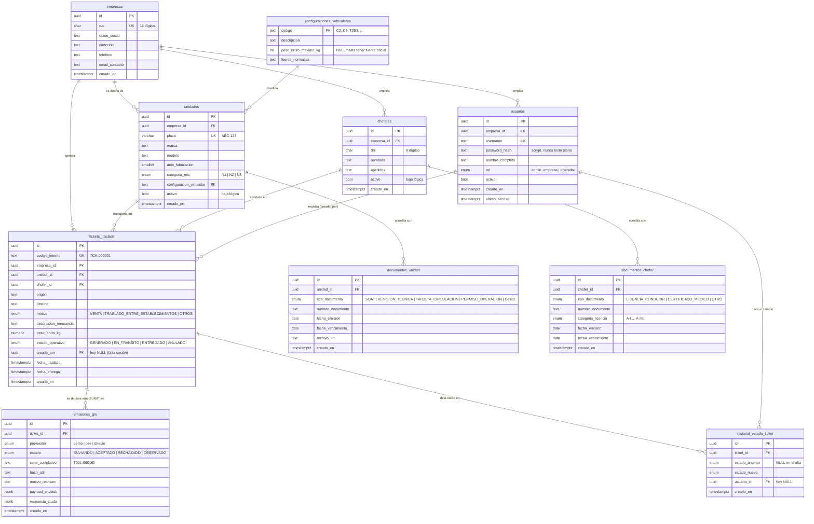
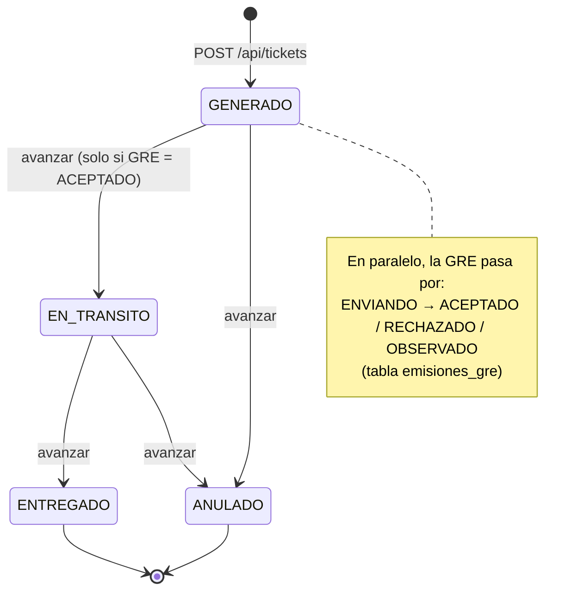

# TransGuía — Modelo de datos y API

Documento de referencia. Dos partes:

1. **Diagrama de entidades** — qué tablas hay en la base (Supabase) y cómo se relacionan.
2. **Endpoints** — para qué sirve cada URL de la API (`server.js`).

> Los diagramas están en formato **Mermaid**: GitHub y VS Code (con la extensión
> "Markdown Preview Mermaid Support") los dibujan solos. Si no, se pueden pegar en
> <https://mermaid.live>.

---

## 1. Diagrama de entidades relacionadas



### Cómo leer las relaciones

| Símbolo | Significado |
|---|---|
| `||--o{` | "uno a muchos": un lado tiene **uno**, el otro puede tener **cero o varios** |
| `PK` | *Primary Key* — identificador único de la fila |
| `FK` | *Foreign Key* — apunta a la fila de otra tabla |
| `UK` | *Unique* — no se puede repetir |

En palabras simples:

- Una **empresa** es el centro de todo: tiene sus **usuarios**, sus **unidades**, sus
  **choferes** y sus **tickets**. Todo lo demás cuelga de ahí.
- Cada **unidad** debe tener una **configuración vehicular** válida (un código del
  Anexo IV del Reglamento Nacional de Vehículos: C2, C3, T3S3…).
- Un **ticket de traslado** junta *una* unidad + *un* chofer + una ruta + una carga.
  La unidad y el chofer **ya deben estar registrados**: el ticket los referencia por
  su `id`, no vuelve a escribir la placa ni el DNI.
- Cada ticket tiene:
  - una o más **emisiones_gre** (el intento de declarar la guía ante SUNAT; se crea
    una fila al generar el ticket, y ahí queda si SUNAT la aceptó, rechazó, etc.);
  - un **historial_estado_ticket** con cada cambio de estado operativo
    (generado → en tránsito → entregado, o anulado).
- **documentos_unidad** y **documentos_chofer** guardan los papeles con vencimiento
  (SOAT, revisión técnica, licencia de conducir, certificado médico…).

### Estado de uso hoy

| Tabla | ¿La usa el backend hoy? |
|---|---|
| `empresas` | Sí (se consulta; se crea por SQL o `sembrar-datos.js`) |
| `usuarios` | Sí — registro / login |
| `configuraciones_vehiculares` | Sí — la referencian las unidades (13 códigos ya cargados; el peso máximo está en NULL a propósito) |
| `unidades` | Sí — alta / listado / baja lógica |
| `choferes` | Sí — alta / listado / baja lógica |
| `tickets_traslado` | Sí — alta / listado / detalle / cambio de estado |
| `emisiones_gre` | Sí — la escribe `ticketsRepoPostgres` al emitir la GRE |
| `historial_estado_ticket` | Sí — se escribe en cada cambio de estado |
| `documentos_unidad` | **Todavía no** — pendiente (paso futuro) |
| `documentos_chofer` | **Todavía no** — pendiente. Por eso el ticket manda `choferLicencia: null` al emisor de GRE |
| `vencimientos_proximos` (vista) | **Todavía no** — une los dos `documentos_*` para alertar vencimientos |

### Ciclo de vida de un ticket



---

## 2. Endpoints de la API

Base local: **`http://localhost:3001`**. Todas las respuestas son JSON.
Los errores llegan como `{ "error": "mensaje entendible" }` con código HTTP 400
(datos inválidos), 401 (login incorrecto) o 404 (no encontrado).

El contrato formal está en `contrato-api.yaml` (OpenAPI 3.1, pegable en
<https://editor.swagger.io>).

### Autenticación

| Método y ruta | Para qué sirve | Entrada | Salida |
|---|---|---|---|
| `POST /api/auth/registro` | Crear un usuario dentro de una empresa que **ya existe**. | `empresaId` (UUID), `username`, `password` (mín. 8), `nombreCompleto`, `rol` opcional (`admin_empresa` / `operador`; por defecto `operador`) | El usuario creado (sin la contraseña) |
| `POST /api/auth/login` | Validar usuario y contraseña para entrar al sistema. | `username`, `password` | `{ id, empresaId, username, nombreCompleto, rol }` — el `empresaId` es lo que el frontend usa después para todo lo demás |

> Nota: la contraseña se guarda como *hash* scrypt, nunca en texto plano. Todavía no
> hay "sesión" real (token/cookie): el frontend simplemente se queda con el
> `empresaId` que devuelve el login.

### Unidades (vehículos de carga)

| Método y ruta | Para qué sirve | Entrada | Salida |
|---|---|---|---|
| `GET /api/unidades?empresaId=<UUID>` | Listar todas las unidades de una empresa (activas e inactivas), ordenadas por placa. | `empresaId` en la URL | Arreglo de unidades |
| `POST /api/unidades` | Registrar una unidad. Valida: placa peruana (3 letras + 3 dígitos), categoría MTC `N1/N2/N3`, año entre 1970 y el próximo, y que la configuración vehicular sea un código válido del Anexo IV. | `empresaId`, `placa`, `marca`, `modelo`, `anioFabricacion` (opcional), `categoriaMtc`, `configuracionVehicular` | La unidad creada |
| `POST /api/unidades/:id/desactivar` | Dar de baja una unidad **sin borrarla** (`activo = false`). Sigue apareciendo en el listado y en los tickets viejos, pero ya no se puede elegir para tickets nuevos. | `id` en la URL | La unidad actualizada |

### Choferes

| Método y ruta | Para qué sirve | Entrada | Salida |
|---|---|---|---|
| `GET /api/choferes?empresaId=<UUID>` | Listar los choferes de una empresa, ordenados por apellido. | `empresaId` en la URL | Arreglo de choferes |
| `POST /api/choferes` | Registrar un chofer. Valida DNI de 8 dígitos y que no se repita dentro de la misma empresa. | `empresaId`, `dni`, `nombres`, `apellidos` | El chofer creado |
| `POST /api/choferes/:id/desactivar` | Baja lógica del chofer (`activo = false`), igual que en unidades. | `id` en la URL | El chofer actualizado |

### Tickets de traslado

| Método y ruta | Para qué sirve | Entrada | Salida |
|---|---|---|---|
| `GET /api/tickets?empresaId=<UUID>` | Listar los tickets de la empresa, del más nuevo al más viejo. Cada uno trae ya el estado de su GRE y los datos de la unidad y el chofer. | `empresaId` en la URL | Arreglo de tickets |
| `POST /api/tickets` | **Generar un ticket y disparar la emisión de la GRE.** Verifica que la unidad y el chofer existan, sean de esa empresa y estén activos. Traduce el `motivo` libre al valor oficial. Responde **de inmediato** con `estadoSunat: "ENVIANDO"` — la GRE se resuelve en segundo plano (1–2 s con el simulador). | `empresaId`, `unidadId`, `choferId`, `origen`, `destino`, `motivo` (opcional), `descripcionMercancia`, `pesoBrutoKg` | El ticket creado (con `codigoInterno` tipo `TCK-000001`) |
| `GET /api/tickets/:id` | Ver un ticket puntual **con el estado actualizado de su GRE**. Es lo que el frontend consulta en bucle después de crear un ticket, hasta que la GRE deja de estar `ENVIANDO`. | `id` en la URL | El ticket, o 404 |
| `POST /api/tickets/:id/avanzar` | Cambiar el estado operativo: `EN_TRANSITO`, `ENTREGADO` o `ANULADO`. Regla: solo se puede avanzar (a en tránsito / entregado) si la GRE fue **ACEPTADA**; anular se permite siempre salvo que ya esté anulado. Marca `fecha_traslado` / `fecha_entrega` automáticamente y deja registro en `historial_estado_ticket`. | `id` en la URL, `{ "estadoOperativo": "EN_TRANSITO" }` en el cuerpo | El ticket actualizado |

### Campos que devuelve un ticket

```jsonc
{
  "id": "uuid",
  "codigoInterno": "TCK-000001",
  "empresaId": "uuid",
  "unidadId": "uuid",           "choferId": "uuid",
  "placa": "ABC-756",           "configuracionVehicular": "T3S3",
  "choferDni": "45678912",      "choferNombres": "Luis Alberto Quispe Mamani",
  "origen": "Lima",             "destino": "Arequipa",
  "motivo": "VENTA",            "descripcionMercancia": "Repuestos industriales",
  "pesoBrutoKg": 8200,
  "estadoOperativo": "GENERADO",          // GENERADO | EN_TRANSITO | ENTREGADO | ANULADO
  "estadoSunat": "ACEPTADO",              // ENVIANDO | ACEPTADO | RECHAZADO | OBSERVADO  (de emisiones_gre)
  "serieCorrelativoGre": "T001-000160",   // null mientras no haya GRE aceptada
  "motivoRechazo": null,
  "fechaTraslado": null,       "fechaEntrega": null,
  "creadoEn": "2026-09-09T04:06:01.433Z"
}
```

---

## Cómo levantar todo (recordatorio)

```bash
node server.js          # API en http://localhost:3001
node sembrar-datos.js   # datos de demo + usuario andina / demo2026seguro
```

Luego abrir `transguia-prototipo.html` en el navegador.
